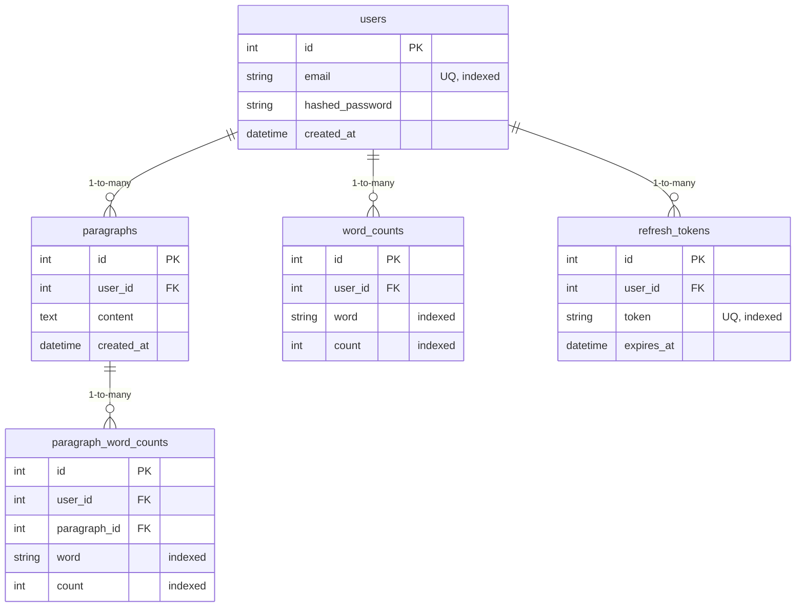

# Text Processing API

A production-ready FastAPI backend for text processing with user authentication, paragraph submission, and efficient word search functionality.

## What This Project Does

- User registration and authentication with JWT tokens
- Submit and store paragraphs of text
- Automatic word indexing and frequency analysis
- Search paragraphs by word with relevance ranking
- RESTful API with automatic documentation

## Features

- **User Authentication**: Secure JWT-based authentication with access and refresh tokens
- **Text Processing**: Efficient word indexing and frequency analysis
- **Search Capabilities**: Fast search with relevance ranking by word frequency
- **Asynchronous Processing**: Background tasks for non-blocking indexing operations
- **Containerized**: Ready for Docker deployment

## System Architecture

### Tech Stack

| Layer | Technology |
|---|---|
| Framework | FastAPI (Python 3.11+) |
| ORM | SQLAlchemy |
| Database | SQLite (dev) / PostgreSQL (prod) |
| Auth | JWT + bcrypt password hashing |
| Background Processing | FastAPI BackgroundTasks |
| API Docs | Auto-generated OpenAPI / Swagger UI |
| Containerization | Docker |

### Database Schema



## Project Structure

```
Text Processing API/
├── app/
│   ├── core/
│   │   ├── database.py        # SQLAlchemy engine, session, Base, init_db
│   │   ├── models.py          # ORM models: User, Paragraph, ParagraphWordCount
│   │   └── schemas.py         # Pydantic request/response schemas
│   ├── routers/
│   │   ├── auth.py            # Register, login endpoints
│   │   └── paragraphs.py      # Submit, list, search endpoints
│   ├── services/
│   │   ├── auth.py            # Password hashing, JWT token logic, create_user
│   │   └── indexing.py        # Background word-count indexing logic
│   ├── utils/
│   │   └── dependencies.py    # get_current_user dependency (JWT validation)
│   ├── __init__.py
│   └── main.py                # FastAPI app entry point, router registration
├── tests/
├── .env.example
├── .gitignore
├── database.db                # SQLite database (local dev only, not committed)
├── Dockerfile
├── requirements.txt
└── README.md
```

## Quick Start

### Prerequisites
- Python 3.11+
- pip (or Docker for containerized setup)

### Installation

1. **Clone the repository:**
   ```bash
   git clone <repository-url>
   cd "py API pj"
   ```

2. **Create and activate a virtual environment:**
   ```bash
   python -m venv .venv

   # Windows
   .venv\Scripts\activate

   # macOS/Linux
   source .venv/bin/activate
   ```

3. **Install dependencies:**
   ```bash
   pip install -r requirements.txt
   ```

4. **Set up environment variables:**
   ```bash
   cp .env.example .env
   # Edit .env with your values
   ```

5. **Run the development server:**
   ```bash
   uvicorn app.main:app --reload --port 8000
   ```

6. **Access the API:**
   - Swagger UI: `http://localhost:8000/docs`
   - Root: `http://localhost:8000/`

### Docker Setup

```bash
docker build -t text-processing-api .
docker run -p 8000:8000 --env-file .env text-processing-api
```

## Environment Variables

Create a `.env` file in the root directory:

```env
SECRET_KEY=your-secret-key-here
ALGORITHM=HS256
ACCESS_TOKEN_EXPIRE_MINUTES=15
REFRESH_TOKEN_EXPIRE_DAYS=7
DATABASE_URL=sqlite:///./database.db
```

Generate a secure secret key:
```bash
openssl rand -hex 32
```

## API Endpoints

### Auth

| Method | Endpoint | Description |
|---|---|---|
| POST | `/auth/register` | Register a new user |
| POST | `/auth/login` | Login and receive JWT token |

### Paragraphs

| Method | Endpoint | Description |
|---|---|---|
| POST | `/paragraphs/` | Submit one or more paragraphs |
| GET | `/paragraphs/` | List your paragraphs (paginated) |
| GET | `/paragraphs/search?word=xyz` | Search paragraphs by word frequency |

> All `/paragraphs/` endpoints require a `Bearer` token in the `Authorization` header.

## Testing Guide

### With Swagger UI

1. Open `http://localhost:8000/docs`
2. **Register** via `POST /auth/register` → `{"email": "test@example.com", "password": "password123"}`
3. **Login** via `POST /auth/login` → copy the `access_token`
4. **Authorize** → click the "Authorize" button → enter `Bearer YOUR_ACCESS_TOKEN`
5. **Submit** via `POST /paragraphs/` → `{"paragraphs": ["Python is great. Python is popular."]}`
6. **Search** via `GET /paragraphs/search?word=python`

### With curl

```bash
# Register
curl -X POST "http://localhost:8000/auth/register" \
  -H "Content-Type: application/json" \
  -d '{"email": "test@example.com", "password": "password123"}'

# Login (save the token)
curl -X POST "http://localhost:8000/auth/login" \
  -H "Content-Type: application/json" \
  -d '{"email": "test@example.com", "password": "password123"}'

# Submit paragraphs (replace TOKEN)
curl -X POST "http://localhost:8000/paragraphs/" \
  -H "Authorization: Bearer TOKEN" \
  -H "Content-Type: application/json" \
  -d '{"paragraphs": ["Test paragraph with words."]}'

# Search (replace TOKEN)
curl -X GET "http://localhost:8000/paragraphs/search?word=test" \
  -H "Authorization: Bearer TOKEN"
```

## Notes

- `database.db` is a local SQLite file for development — do not commit it (already in `.gitignore`)
- For production, swap `DATABASE_URL` to a PostgreSQL connection string and update the engine config

---

