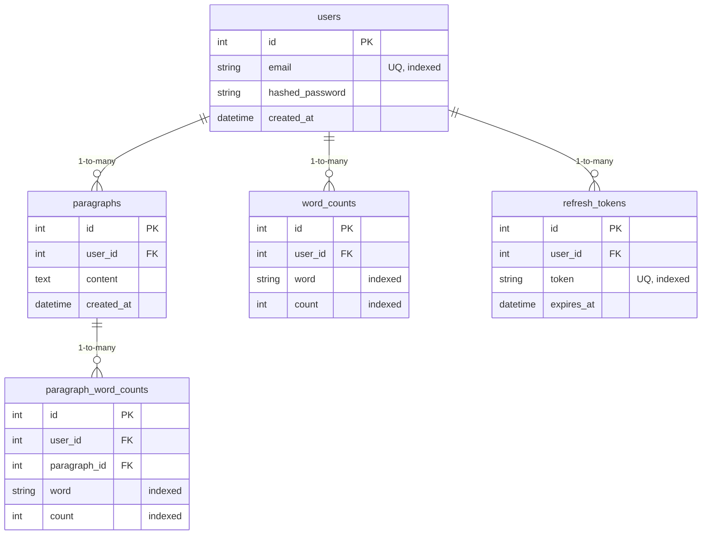

# Text Processing API

A FastAPI backend for text processing with user authentication, paragraph submission, and efficient word search functionality.

## What This Project Does

- User registration and authentication with JWT tokens
- Submit and store paragraphs of text
- Automatic word indexing and frequency analysis
- Search paragraphs by word with relevance ranking
- RESTful API with automatic documentation

## Features

- **User Authentication**: Secure JWT-based authentication with refresh tokens
- **Text Processing**: Efficient word indexing and frequency analysis
- **Search Capabilities**: Fast search with relevance ranking by word frequency
- **Asynchronous Processing**: Background tasks for non-blocking operations
- **Containerized**: Ready for Docker deployment

## System Architecture

### Tech Stack

- **Backend Framework**: FastAPI (Python 3.11+)
- **Database**: SQLAlchemy ORM with SQLite
- **Authentication**: JWT with bcrypt password hashing
- **Background Processing**: FastAPI BackgroundTasks
- **API Documentation**: Auto-generated OpenAPI/Swagger UI
- **Containerization**: Docker

### Database Schema



## Quick Start

### Prerequisites
- Python 3.11+
- pip (or Docker for containerized setup)

### Installation

1. **Clone repository:**
   ```bash
   git clone <repository-url>
   cd "py API pj"
   ```

2. **Install dependencies:**
   ```bash
   pip install -r requirements.txt
   ```

3. **Set up environment:**
   ```bash
   cp .env.example .env
   # Edit .env with your secret key
   ```

4. **Run application:**
   ```bash
   uvicorn app.main:app --reload --port 8000
   ```

5. **Access API:**
   - **API Documentation**: `http://localhost:8000/docs`
   - **Root Endpoint**: `http://localhost:8000/`

### Docker Setup

```bash
# Build and run
docker build -t text-api .
docker run -p 8000:8000 --env-file .env text-api
```

## Environment Variables

Create a `.env` file in the root directory:

```env
SECRET_KEY=your-secret-key-here
ALGORITHM=HS256
ACCESS_TOKEN_EXPIRE_MINUTES=15
REFRESH_TOKEN_EXPIRE_DAYS=7
```

Generate a secure secret key:
```bash
openssl rand -hex 32
```

## Short Testing Guide

### 1. Start the Application
```bash
uvicorn app.main:app --reload --port 8000
```

### 2. Test with Swagger UI
1. Open `http://localhost:8000/docs`
2. **Register User:**
   - Use `POST /auth/register`
   - `{"email": "test@example.com", "password": "password123"}`
3. **Login:**
   - Use `POST /auth/login`
   - Copy the `access_token` from response
4. **Authorize:**
   - Click "Authorize" button (top right)
   - Enter: `Bearer YOUR_ACCESS_TOKEN`
5. **Submit Paragraphs:**
   - Use `POST /paragraphs/`
   - `{"paragraphs": ["Python is great. Python is popular.", "I love coding."]}`
6. **Search:**
   - Use `GET /paragraphs/search?word=python`

### 3. Test with curl

```bash
# Register
curl -X POST "http://localhost:8000/auth/register" \
  -H "Content-Type: application/json" \
  -d '{"email": "test@example.com", "password": "password123"}'

# Login (save the token)
curl -X POST "http://localhost:8000/auth/login" \
  -H "Content-Type: application/json" \
  -d '{"email": "test@example.com", "password": "password123"}'

# Submit paragraphs (replace TOKEN)
curl -X POST "http://localhost:8000/paragraphs/" \
  -H "Authorization: Bearer TOKEN" \
  -H "Content-Type: application/json" \
  -d '{"paragraphs": ["Test paragraph with words."]}'

# Search (replace TOKEN)
curl -X GET "http://localhost:8000/paragraphs/search?word=test" \
  -H "Authorization: Bearer TOKEN"
```

## Project Structure

```
Text Processing API/
|
|__ app/
|   |
|   |__ core/
|   |   |
|   |   |__ database.py
|   |   |__ models.py
|   |   |__ schemas.py
|   |
|   |__ routers/
|   |   |
|   |   |__ auth.py
|   |   |__ paragraphs.py
|   |
|   |__ services/
|   |   |
|   |   |__ auth.py
|   |   |__ indexing.py
|
|__ tests/
|
|__ utils/
|   |
|   |__ dependencies.py
|
|__ main.py
|__ .env.example
|__ requirements.txt
|__ Dockerfile
|__ README.md
```
